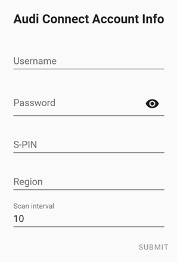

[![hacs][hacsbadge]](hacs)
![Project Maintenance][maintenance-shield]
[![BuyMeCoffee][buymecoffeebadge]][buymecoffee]

## Configuration

Configuration is done through the Home Assistant UI.

To add the integration, go to `Configuration->Integrations`, click `+` and search for `Audi Connect`

## Configuration Variables

**username**

- (string)(Required)The username associated with your Audi Connect account.

**password**

- (string)(Required)The password for your given Audi Connect account.

**S-PIN**

- (string)(Optional)The S-PIN for your given Audi Connect account.

**region**

- (string)(Optional)The region where the Audi account is registered. Set to 'DE' for Europe (or leave unset), to 'US' for North America, or to 'CN' for China.

**scan_interval**

- specify in minutes how often to fetch status data from Audi Connect (optional, default 10 min, minimum 1 min)

[buymecoffee]: https://buymeacoff.ee/arjenvrh
[buymecoffeebadge]: https://img.shields.io/badge/buy%20me%20a%20beer-donate-yellow.svg?style=for-the-badge
[commits-shield]: https://img.shields.io/github/commit-activity/y/arjenvrh/audi_connect_ha?style=for-the-badge
[commits]: https://github.com/arjenvrh/audi_connect_ha/commits/master
[hacs]: https://github.com/custom-components/hacs
[hacsbadge]: https://img.shields.io/badge/HACS-Default-orange.svg?style=for-the-badge
[license-shield]: https://img.shields.io/github/license/arjenvrh/audi_connect_ha?style=for-the-badge
[maintenance-shield]: https://img.shields.io/badge/maintainer-Arjen%20van%20Rhijn%20%40arjenvrh-blue.svg?style=for-the-badge
[blackbadge]: https://img.shields.io/badge/code%20style-black-000000.svg?style=for-the-badge
[black]: https://github.com/ambv/black
