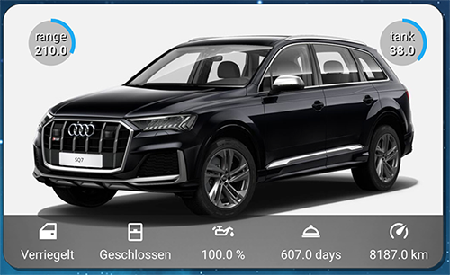

# Audi Connect Integration for Home Assistant

[![GitHub Activity][commits-shield]][commits]
[![License][license-shield]](LICENSE.md)
[![Code Style][blackbadge]][black]

[![hacs][hacsbadge]](hacs)

## Notice

Due to API changes it might be that currently not all functionality is given. Please open a issue to report the topics you are missing.

## Maintainers Wanted

Due to time limitations this project is not actively maintained anymore. It will continue to work as long as Audi does not change the API again.
However, I'm open to someone else taking the lead. If you would like to become a maintainer, please contact me.

## Description

The `audiconnect` component provides an integration with the Audi Connect cloud service. It adds presence detection, sensors such as range, mileage, and fuel level, and provides car actions such as locking/unlocking and setting the pre-heater.

**Note:** Certain functions require special permissions from Audi, such as position update via GPS.

Credit for initial API discovery go to the guys at the ioBroker VW-Connect forum, who were able to figure out how the API and the PIN hashing works. Also some implementation credit to davidgiga1993 of the original [AudiAPI](https://github.com/davidgiga1993/AudiAPI) Python package, on which some of this code is loosely based.

## Installation

There are two ways this integration can be installed into [Home Assistant](https://www.home-assistant.io).

The easiest and recommended way is to install the integration using [HACS](https://hacs.xyz), which makes future updates easy to track and install.

Alternatively, installation can be done manually by copying the files in this repository into the `custom_components` directory in the Home Assistant configuration directory:

1. Open the configuration directory of your Home Assistant installation.
2. If you do not have a `custom_components` directory, create it.
3. In the `custom_components` directory, create a new directory called `audiconnect`.
4. Copy all files from the `custom_components/audiconnect/` directory in this repository into the `audiconnect` directory.
5. Restart Home Assistant.
6. Add the integration to Home Assistant (see **Configuration**).

## Configuration

Configuration is done through the Home Assistant UI.

To add the integration, go to **Settings ➤ Devices & Services ➤ Integrations**, click **➕ Add Integration**, and search for "Audi Connect".


### Configuration Variables

**username**

- (string)(Required) The username associated with your Audi Connect account.

**password**

- (string)(Required) The password for your Audi Connect account.

**S-PIN**

- (string)(Optional) The S-PIN for your Audi Connect account.

**region**

- (string)(Optional) The region where your Audi Connect account is registered.
  - 'DE' for Europe (or leave unset)
  - 'US' for United States of America
  - 'CA' for Canada
  - 'CN' for China

**scan_interval**

- (number)(Optional) The frequency in minutes for how often to fetch status data from Audi Connect. (Optional. Default is 10 minutes, can be no more frequent than 1 min.)

## Services

**audiconnect.refresh_vehicle_data**

Normal updates retrieve data from the Audi Connect service, and don't interact directly with the vehicle. _This_ service triggers an update request from the vehicle itself. When data is retrieved successfully, Home Assistant is automatically updated. The service requires a vehicle identification number (VIN) as a parameter.

**audiconnect.execute_vehicle_action**

Perform an action on the vehicle. The service takes a VIN and the action to perform as parameters. Possible action values:

- lock
- unlock
- start_climatisation
- stop_climatisation
- start_charger
- start_timed_charger
- stop_charger
- start_preheater
- stop_preheater
- start_window_heating
- stop_window_heating

**Note:** Certain action require the S-PIN to be set in the configuration.

When an action is successfully performed, an update request is automatically triggered.

## Example Dashboard Card

Below is an example Dashboard (Lovelace) card illustrating some of the sensors this Home Assistant addon provides.



The card requires the following front end mods:

- https://github.com/thomasloven/lovelace-card-mod
- https://github.com/custom-cards/circle-sensor-card

These mods can (like this integration) be installed using HACS.

The card uses the following code in `ui-lovelace.yaml` (or wherever your Dashboard is configured).

```yaml
     - type: picture-elements
        image: /local/pictures/audi_sq7.jpeg
        style: |
          ha-card {
            border-radius: 10px;
            border: solid 1px rgba(100,100,100,0.3);
            box-shadow: 3px 3px rgba(0,0,0,0.4);
            overflow: hidden;
          }
        elements:
        - type: image
          image: /local/pictures/cardbackK.png
          style:
            left: 50%
            top: 90%
            width: 100%
            height: 60px

        - type: icon
          icon: mdi:car-door
          entity: sensor.doors_trunk_sq7
          tap_action: more_info
          style: {color: white, left: 10%, top: 86%}
        - type: state-label
          entity: sensor.doors_trunk_sq7
          style: {color: white, left: 10%, top: 95%}

        - type: state-icon
          entity: sensor.windows_sq7
          tap_action: more_info
          style: {color: white, left: 30%, top: 86%}
        - type: state-label
          entity: sensor.windows_sq7
          style: {color: white, left: 30%, top: 95%}

        - type: icon
          icon: mdi:oil
          entity: sensor.audi_sq7_oil_level
          tap_action: more_info
          style: {color: white, left: 50%, top: 86%}
        - type: state-label
          entity: sensor.audi_sq7_oil_level
          style: {color: white, left: 50%, top: 95%}

        - type: icon
          icon: mdi:room-service-outline
          entity: sensor.audi_sq7_service_inspection_time
          tap_action: more_info
          style: {color: white, left: 70%, top: 86%}
        - type: state-label
          entity: sensor.audi_sq7_service_inspection_time
          style: {color: white, left: 70%, top: 95%}

        - type: icon
          icon: mdi:speedometer
          entity: sensor.audi_sq7_mileage
          tap_action: more_info
          style: {color: white, left: 90%, top: 86%}
        - type: state-label
          entity: sensor.audi_sq7_mileage
          style: {color: white, left: 90%, top: 95%}

        - type: custom:circle-sensor-card
          entity: sensor.audi_sq7_tank_level
          max: 100
          min: 0
          stroke_width: 15
          gradient: true
          fill: '#aaaaaabb'
          name: tank
          units: ' '
          font_style:
            font-size: 1.0em
            font-color: white
            text-shadow: '1px 1px black'
          style:
            top: 5%
            left: 80%
            width: 4em
            height: 4em
            transform: none

        - type: custom:circle-sensor-card
          entity: sensor.audi_sq7_range
          max: 630
          min: 0
          stroke_width: 15
          gradient: true
          fill: '#aaaaaabb'
          name: range
          units: ' '
          font_style:
            font-size: 1.0em
            font-color: white
            text-shadow: '1px 1px black'
          style:
            top: 5%
            left: 5%
            width: 4em
            height: 4em
            transform: none
```

[buymecoffee]: https://buymeacoff.ee/arjenvrh
[buymecoffeebadge]: https://img.shields.io/badge/buy%20me%20a%20beer-donate-yellow.svg?style=for-the-badge
[commits-shield]: https://img.shields.io/github/commit-activity/y/arjenvrh/audi_connect_ha?style=for-the-badge
[commits]: https://github.com/arjenvrh/audi_connect_ha/commits/master
[hacs]: https://github.com/custom-components/hacs
[hacsbadge]: https://img.shields.io/badge/HACS-Default-orange.svg?style=for-the-badge
[license-shield]: https://img.shields.io/github/license/arjenvrh/audi_connect_ha?style=for-the-badge
[maintenance-shield]: https://img.shields.io/badge/maintainer-Arjen%20van%20Rhijn%20%40arjenvrh-blue.svg?style=for-the-badge
[blackbadge]: https://img.shields.io/badge/code%20style-black-000000.svg?style=for-the-badge
[black]: https://github.com/ambv/black
